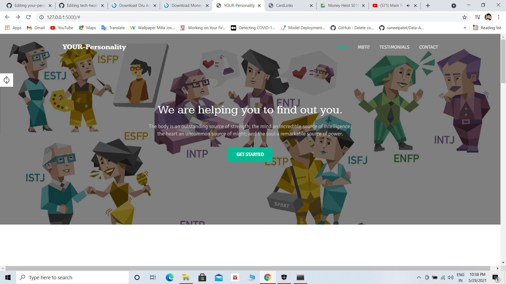
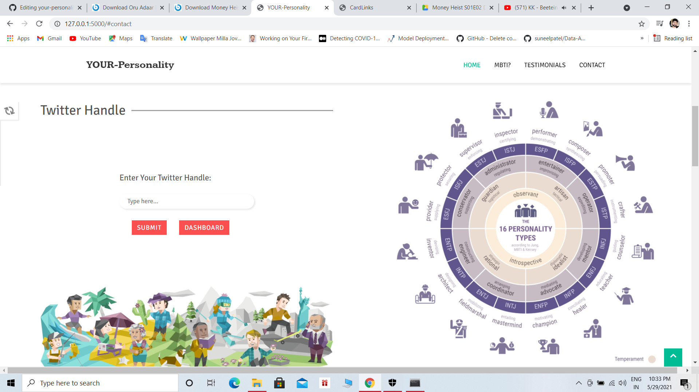
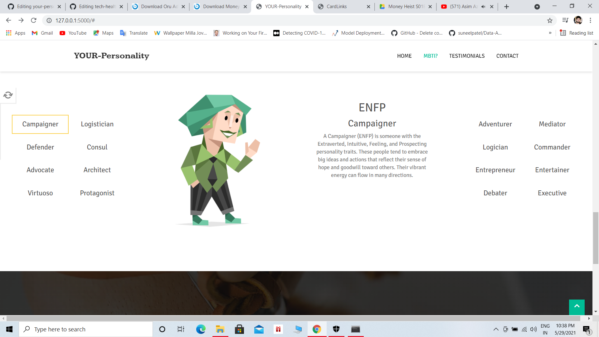
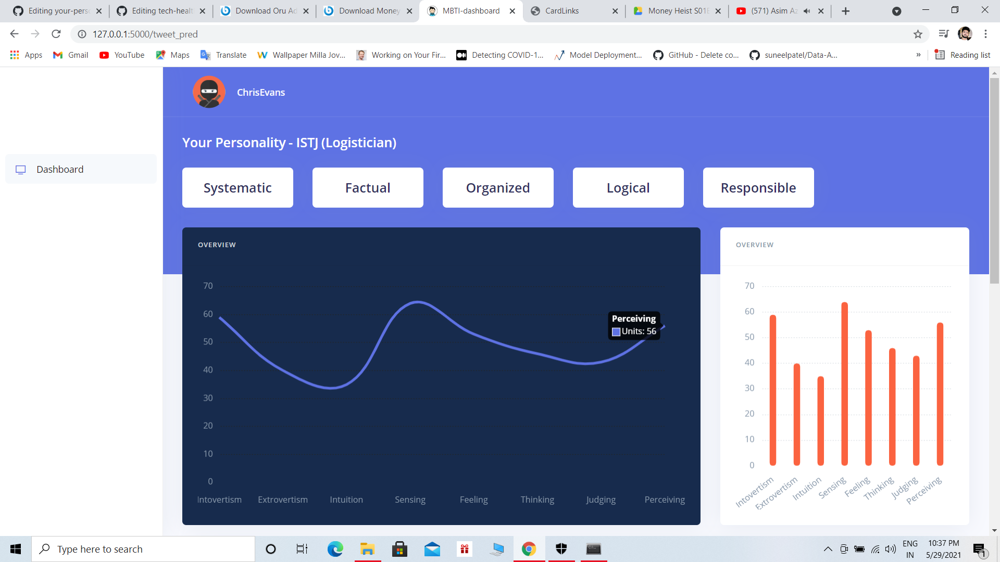

# Your-Personality
## _Our Mission to find out inner you on the bases of MBTI 16 personality.

<a target="_blank" href="www.linkedin.com/in/aman-sharma-01b185190/">
  
</a>  <a target="_blank" href="https://www.instagram.com/aman___sharma/">
  </a>  <a target="_blank" href="mailto:aman.sharmatds1999@gmail.com"> 
  
</a>  <a target="_blank" href="https://portfolioaman.herokuapp.com/">
  
</a>  
<br>
<br>

   


## 📈Datasets 
[MBTI-Dataset](https://www.kaggle.com/datasnaek/mbti-type) <br>

## 📝Table of Content
  * [Overview](#Overview)
  * [Motivation](#Motivation)
  * [Installation and run](#Installation-and-run)
  * [what is MBTI?](#MBTI)
  * [MBTI Types](#MBTI-types)
  * [Tech Libraries and Models](#Tech-Libraries-and-Models)
  * [Contributing](#Contributing)
  * [Bug / Feature Request](#Bug-/-Feature-Request)
  * [Created By](#Created-By)
  
 ## 📜Overview
  This project is based on MBTI 16 personality which helps to identify user personality by using Twitter handle and Berst-base-uncased Model.
  
  
## Samples Pictures or Demo

  





## Video_Demo
<!-- []() -->
 
 
 
## Results 
| Model | Train acc. | Val acc. |  
| :---: |:---:| :---:| :---: |
| LSTM | 22 % | 18 % |  
| :---: |:---:| :---:| :---: |
| BERT | 88 % | 87 % | 


 ## 🔑Installation and run

1. Clone the repository 
```sh
https://github.com/mrperfectpandit/your-personality.git
```
2. Create virtual environment
```sh
conda create --name myenv
```
3.Make a folders in same path <br>
    👉twitter_data --> it will kept the user_personality and follower result in CSV format.
  
The Code is written in Python 3.7.10. If you don't have Python installed you can find it [here](https://www.python.org/downloads/) and Tensorflow 2.3.1. If you are using a lower version of Python and Tensorflow you can upgrade using the pip package, ensuring you have the latest version of pip. To install the required packages and libraries, run this command in the project directory after cloning the repository:

4. Install the dependencies and devDependencies and start the server.

```sh
pip install -r requirements.txt
```

For production environments...

```sh
cd where you clone the repo
python app.py
or 
flask run --port 8085
```
<b>when you put a twitter handle it will take some time because that time data is fetch from twitter through twitter API.</b>
  
  
  ## 🤔MBTI
  Both Myers and Briggs were fascinated by Jung's theory of psychological types and recognized that the theory could have real-world applications. During World War II, they       began researching and developing an indicator that could be utilized to help understand individual differences.<br>
  <b><i>By helping people understand themselves, Myers and Briggs believed that they could help people select occupations that were best suited to their personality types and lead healthier, happier lives.</i></b>
  <br>
  <p>
  The goal of the MBTI is to allow respondents to further explore and understand their own personalities including their likes, dislikes, strengths, weaknesses, possible career preferences, and compatibility with other people.<br>

No one personality type is "best" or "better" than another. It isn't a tool designed to look for dysfunction or abnormality. Instead, its goal is simply to help you learn more about yourself. The questionnaire itself is made up of four different scales.</p>

### 👉Extraversion (E) – Introversion (I)
<p>The extraversion-introversion dichotomy was first explored by Jung in his theory of personality types as a way to describe how people respond and interact with the world around them. While these terms are familiar to most people, the way in which they are used in the MBTI differs somewhat from their popular usage.
    
Extraverts (also often spelled extroverts) are "outward-turning" and tend to be action-oriented, enjoy more frequent social interaction, and feel energized after spending time with other people. Introverts are "inward-turning" and tend to be thought-oriented, enjoy deep and meaningful social interactions, and feel recharged after spending time alone.</p>
 <b><i>We all exhibit extraversion and introversion to some degree, but most of us tend to have an overall preference for one or the other</i></b>


### 👉Sensing (S) – Intuition (N)
<p>This scale involves looking at how people gather information from the world around them. Just like with extraversion and introversion, all people spend some time sensing and intuiting depending on the situation. According to the MBTI, people tend to be dominant in one area or the other.

People who prefer sensing tend to pay a great deal of attention to reality, particularly to what they can learn from their own senses. They tend to focus on facts and details and enjoy getting hands-on experience. Those who prefer intuition pay more attention to things like patterns and impressions. They enjoy thinking about possibilities, imagining the future, and abstract theories.</p>
 

### 👉Thinking (T) – Feeling (F)
<p>This scale focuses on how people make decisions based on the information that they gathered from their sensing or intuition functions. People who prefer thinking place a greater emphasis on facts and objective data.

They tend to be consistent, logical, and impersonal when weighing a decision. Those who prefer feeling are more likely to consider people and emotions when arriving at a conclusion.</p>
 

### 👉Judging (J) – Perceiving (P)
<p>The final scale involves how people tend to deal with the outside world. Those who lean toward judging prefer structure and firm decisions. People who lean toward perceiving are more open, flexible, and adaptable. These two tendencies interact with the other scales.

Remember, all people at least spend some time extraverting. The judging-perceiving scale helps describe whether you extravert when you are taking in new information (sensing and intuiting) or when you are making decisions (thinking and feeling).</p>


## MBTI types
Each type is then listed by its four-letter code:
<b><i>According to the Myers & Briggs Foundation, it is important to remember that all types are equal and that every type has value.</b></i>

😉[ISTJ - The Inspector](https://www.verywellmind.com/istj-introversion-sensing-thinking-judgment-2795992)<br>
😁[ISTP - The Crafter](https://www.verywellmind.com/istp-introverted-sensing-thinking-perceiving-2795993)<br>
😃[ISFJ - The Protector](https://www.verywellmind.com/isfj-introverted-sensing-feeling-judging-2795990)<br>
😍[ISFP - The Artist](https://www.verywellmind.com/isfp-introverted-sensing-feeling-perceiving-2795991)<br>
😚[INFJ - The Advocate](https://www.verywellmind.com/infj-introverted-intuitive-feeling-judging-2795978)<br>
😛[INFP - The Mediator](https://www.verywellmind.com/infp-a-profile-of-the-idealist-personality-type-2795987)<br>
😕[INTJ - The Architect](https://www.verywellmind.com/intj-introverted-intuitive-thinking-judging-2795988)<br>
🤔[INTP - The Thinker](https://www.verywellmind.com/intp-introverted-intuitive-thinking-perceiving-2795989)<br>
🥱[ESTP - The Persuader](https://www.verywellmind.com/estp-extraverted-sensing-thinking-perceiving-2795986)<br>
😇[ESTJ - The Director](https://www.verywellmind.com/estj-extraverted-sensing-thinking-judging-2795985)<br>
😊[ESFP - The Performer](https://www.verywellmind.com/esfp-extraverted-sensing-feeling-perceiving-2795984)<br>
🤗[ESFJ - The Caregiver](https://www.verywellmind.com/esfj-extraverted-sensing-feeling-judging-2795983)<br>
😎[ENFP - The Champion](https://www.verywellmind.com/enfp-an-overview-of-the-champion-personality-type-2795980)<br>
😳[ENFJ - The Giver](https://www.verywellmind.com/enfj-extraverted-intuitive-feeling-judging-2795979)<br>
😠[ENTP - The Debater](https://www.verywellmind.com/the-entp-personality-type-and-characteristics-2795982)<br>
🤫[ENTJ - The Commander](https://www.verywellmind.com/entj-personality-type-2795981)

## 🛠Tech Libraries and Models
   [](https://jupyter.org/try) 
<br>
[](https://developer.twitter.com/en/docs/twitter-api)[](https://blog.google/products/search/search-language-understanding-bert/)


 [](http://ForTheBadge.com)  [](http://ForTheBadge.com)  []()


[](https://flask.palletsprojects.com/en/1.1.x/)   [](https://scikit-learn.org/stable/)   [](https://numpy.org/) 
<br>
[](https://www.tensorflow.org/install)  [](https://pypi.org/project/Keras/)   


## 🤝Contributing

1. Fork it (<https://github.com/yourname/yourproject/fork>)
2. Create your feature branch (`git checkout -b feature/fooBar`)
3. Commit your changes (`git commit -am 'Add some fooBar'`)
4. Push to the branch (`git push origin feature/fooBar`)
5. Create a new Pull Request


## 🐞Bug / Feature Request

If you find a bug (the website couldn't handle the query and / or gave undesired results), kindly open an [issue](https://github.com/mrperfectpandit/inventory-tracker/issues) here by including your search query and the expected result

## 🙇‍♀️⚡Created By

[Aman Sharma](https://github.com/mrperfectpandit)
<br>
[Mitansh Rajpoot]()


